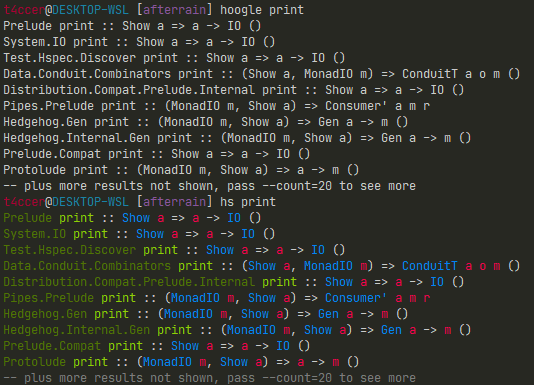

# afterrain
  After rain comes rainbow, and with rainbow come colors. Add some colors to your terminal with `afterrain`.

## Installation
### Requirements: 
 - Stack

  ```bash
  git clone https://github.com/t4ccer/afterrain
  cd afterrain
  stack build --copy-bins
  ```

## Usage
  ### Hoogle output highlighting:

  

  ```bash
  hoogle <command> | aft hoogle
  ```
  OR  
  
  
  Add this to your .bashrc
  ```bash
  hs(){
    hoogle "$@" | aft hoogle
  }
  ```
  ```bash
  hs <command>
  ```

## Configuration
  Config file is located in `$HOME/.afterrain.yaml`, and is created automatically after the first run.  
  Fields suffixed with `color256` applies for  256 color terminals and with `color8` suffix for 8 color terminal. Values for 8 color terminal must be prefixed with `E`.

## Supported features
 - Hoogle highlighting
 - Highlight customization

## Planned features
 - More programs support
